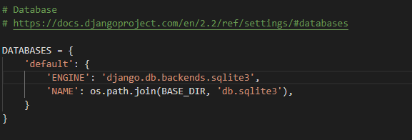

# Django

## 简介

​	一个开放源代码的Web应用框架，由Python写出

​	初次发布于2005年7月，并于2008年9月发布 第一个正式版本1.0

### MTV

​	本质上于MVC模式没有区别，只是定义上有些不同

- Model  负责业务对象于数据库的对象
- Template   负责如何把页面展示给用户
- View   负责业务逻辑，并在适当的时候调用Model于Template

​	Django有一个url分发器，将一个个URL的页面请求分发给不同的view处理，view再调用相应的Model和Template

## 创建

### 新建项目结构

​		`django-admin startproject projectname` 命令创建django基本项目结构

​	**目录结构**

```shell
djangoDemo			
    │  manage.py	#命令工具，对django项目进行交互
    │
    └─djangoDemo
          settings.py	#项目配置文件
          urls.py		#项目的url声明
          wsgi.py		#项目与WSGI兼容的Web服务入口
          __init__.py 	#空文件，表示该目录为python包
        
```

### 配置数据库

​	**Django默认使用SQLite数据库**

​	**在settings.py文件中，通过DATABASES选项进行数据库配置**



>**1、python3.x 安装 PyMySQL**
>
>**2、\_init_.py写入**
>
>```python
>import pymysql
>
>pymysql.install_as_MySQLdb()
>```
>
>**3、settings.py配置数据库**
>
>```python
>DATABASES = {
>    'default': {
>        'ENGINE': 'django.db.backends.mysql',
>        'NAME':'djangoDemo',
>        'USER':'root',
>        'PASSWORD':'root',
>        'HOST':'localhost',
>        'PORT':3306,
>    }
>}
>```

### 创建应用

​	**一个项目中可以创建多个应用，每个应用进行一种业务处理**

​	**在项目根目录下执行`python manage.py startapp appName`**

​	**应用目录**

```shell
admin.py：站点配置

models.py：模型

views.py：试图
```

### 激活应用

​	在`setting.py`文件中，将创建的应用名加入到`INSTALLED_APPS`中

### 定义模型

​	一个数据表，就对应一个模型

>- 在models.py文件中定义模型
>
>- 引入`from django.db import models`
>
>- 模型类要继承models.Model类
>- 不需要定义主键，会自动生成，为自增

### 在数据库生成数据表

**`python manage.py makemigrations`** ：生成迁移文件在，migrations目录下生成一个迁移文件，此时数据库还没有生成表


**`python manage.py migrate`** ：执行迁移，相当于执行sql语句创建数据表


### 测试数据操作

**`python manage.py shell`** ： 进入python shell

引入包：

```pytho
from myApp.models import Grades,Students
from django.utils import timezone
from datetime import * 
```


### 启动服务

​	**`python manage.py runserver ip:port`**

​	ip可以不写（默认是本机IP），端口号默认为8000

​	该方式是存python写的轻量级web服务器，仅在开发测试中使用


### Admin站点管理

​	负责添加、修改、删除内容（数据库），公告访问

#### **配置Admin应用(setting.py)**

```python
INSTALLED_APPS = [
    'django.contrib.admin',
```

#### **创建管理员用户**

​	**`python manage.py createsuperuser`**


#### **国际化**

​	修改setting.py，重启服务

```python
# LANGUAGE_CODE = 'en-us'
LANGUAGE_CODE = 'zh-Hans'

# TIME_ZONE = 'UTC'
TIME_ZONE = 'Asia/ShangHai'
```

#### **管理数据表**

​	**修改admin.py**


​	**自定义管理页面**

```python
class GradesAdmin(admin.ModelAdmin):
    # 列表页属性
    list_display = ['pk', 'gname', 'gdate', 'ggirlnum', 'gboynum', 'isDelete']
    list_filter = ['gname']
    search_fields = ['gname', 'gboynum']
    list_per_page = 10

    # 添加、修改页属性
    # fields与fieldsets属性不能同时使用
    # fields = ['gname', 'isDelete']
    fieldsets = [
        ('num',{'fields':['ggirlnum','gboynum']}),
        ('base',{'fields':['gname','gdate','isDelete']})
    ]

admin.site.register(Grades, GradesAdmin)
```


​	**关联属性**

```python
class StudentsInfo(admin.TabularInline): #StackedInline
    model = Students
    extra = 2

class GradesAdmin(admin.ModelAdmin):
    inlines = [StudentsInfo]
```


​	**其他属性**

```python
# 使用装饰器注册
@admin.register(Students)
class StudentsAdmin(admin.ModelAdmin):
    # 设置列值
    def gender(self):
        if self.sgender:
            return 'man'
        else:
            return 'woman'
    # 设置页面列的名称
    gender.short_description = '性別'

    # 执行动作的位置
    actions_on_bottom = True
    actions_on_top = False
```


# 报错

**Django2.2报错 AttributeError: 'str' object has no attribute 'decode'**

> 1、d:\Python\lib\site-packages\django\db\backends\mysql\operations.py
>
> 2、
>
> ```python
> def last_executed_query(self, cursor, sql, params):
>         # With MySQLdb, cursor objects have an (undocumented) "_executed"
>         # attribute where the exact query sent to the database is saved.
>         # See MySQLdb/cursors.py in the source distribution.
>         query = getattr(cursor, '_executed', None)
>        
>     #注释该段代码
>         # if query is not None:
>         #     query = query.decode(errors='replace')
>         return query
> ```
>
>  query 是 str 类型，而 `decode()` 是用来将 bytes 转换成 string 类型用的，[（关于Python编码点这里）](https://www.cnblogs.com/dbf-/p/10572765.html)，由于 query 不需要解码，所以直接将 if 语句注释掉