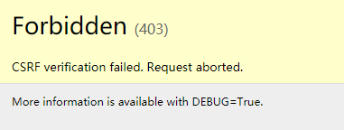

# Django

## 一、简介

​	一个开放源代码的Web应用框架，由Python写出

​	初次发布于2005年7月，并于2008年9月发布 第一个正式版本1.0

### MTV

​	本质上于MVC模式没有区别，只是定义上有些不同

- Model  负责业务对象于数据库的对象
- Template   负责如何把页面展示给用户
- View   负责业务逻辑，并在适当的时候调用Model于Template

​	Django有一个url分发器，将一个个URL的页面请求分发给不同的view处理，view再调用相应的Model和Template

## 二、创建

### 新建项目结构

​		`django-admin startproject projectname` 命令创建django基本项目结构

​	**目录结构**

```shell
djangoDemo			
    │  manage.py	#命令工具，对django项目进行交互
    │
    └─djangoDemo
          settings.py	#项目配置文件
          urls.py		#项目的url声明
          wsgi.py		#项目与WSGI兼容的Web服务入口
          __init__.py 	#空文件，表示该目录为python包
        
```

### 配置数据库

​	**Django默认使用SQLite数据库**

​	**在settings.py文件中，通过DATABASES选项进行数据库配置**


>**1、python3.x 安装 PyMySQL**
>
>**2、\_init_.py写入**
>
>```python
>import pymysql
>
>pymysql.install_as_MySQLdb()
>```
>
>**3、settings.py配置数据库**
>
>```python
>DATABASES = {
>    'default': {
>        'ENGINE': 'django.db.backends.mysql',
>        'NAME':'djangoDemo',
>        'USER':'root',
>        'PASSWORD':'root',
>        'HOST':'localhost',
>        'PORT':3306,
>    }
>}
>```

### 创建应用

​	**一个项目中可以创建多个应用，每个应用进行一种业务处理**

​	**在项目根目录下执行`python manage.py startapp appName`**

​	**应用目录**

```shell
admin.py：站点配置

models.py：模型

views.py：试图
```

### 激活应用

​	在`setting.py`文件中，将创建的应用名加入到`INSTALLED_APPS`中

### 定义模型

​	一个数据表，就对应一个模型

>- 在models.py文件中定义模型
>
>- 引入`from django.db import models`
>
>- 模型类要继承models.Model类
>- 不需要定义主键，会自动生成，为自增

### 在数据库生成数据表

**`python manage.py makemigrations`** ：生成迁移文件在，migrations目录下生成一个迁移文件，此时数据库还没有生成表


**`python manage.py migrate`** ：执行迁移，相当于执行sql语句创建数据表


### 测试数据操作

**`python manage.py shell`** ： 进入python shell

引入包：

```pytho
from myApp.models import Grades,Students
from django.utils import timezone
from datetime import * 
```


### 启动服务

​	**`python manage.py runserver ip:port`**

​	ip可以不写（默认是本机IP），端口号默认为8000

​	该方式是存python写的轻量级web服务器，仅在开发测试中使用


### Admin站点管理

​	负责添加、修改、删除内容（数据库），公告访问

#### **配置Admin应用(setting.py)**

```python
INSTALLED_APPS = [
    'django.contrib.admin',
```

#### **创建管理员用户**

​	**`python manage.py createsuperuser`**


#### **国际化**

​	修改setting.py，重启服务

```python
# LANGUAGE_CODE = 'en-us'
LANGUAGE_CODE = 'zh-Hans'

# TIME_ZONE = 'UTC'
TIME_ZONE = 'Asia/ShangHai'
```

#### **管理数据表**

​	**修改admin.py**


​	**自定义管理页面**

```python
class GradesAdmin(admin.ModelAdmin):
    # 列表页属性
    list_display = ['pk', 'gname', 'gdate', 'ggirlnum', 'gboynum', 'isDelete']
    list_filter = ['gname']
    search_fields = ['gname', 'gboynum']
    list_per_page = 10

    # 添加、修改页属性
    # fields与fieldsets属性不能同时使用
    # fields = ['gname', 'isDelete']
    fieldsets = [
        ('num',{'fields':['ggirlnum','gboynum']}),
        ('base',{'fields':['gname','gdate','isDelete']})
    ]

admin.site.register(Grades, GradesAdmin)
```


​	**关联属性**

```python
class StudentsInfo(admin.TabularInline): #StackedInline
    model = Students
    extra = 2

class GradesAdmin(admin.ModelAdmin):
    inlines = [StudentsInfo]
```


​	**其他属性**

```python
# 使用装饰器注册
@admin.register(Students)
class StudentsAdmin(admin.ModelAdmin):
    # 设置列值
    def gender(self):
        if self.sgender:
            return 'man'
        else:
            return 'woman'
    # 设置页面列的名称
    gender.short_description = '性別'

    # 执行动作的位置
    actions_on_bottom = True
    actions_on_top = False
```

### 试图基本使用

​	在django中，试图对web请求进行回应

​	试图是一个python函数，在views.py中定义

**定义试图——修改views.py**

```python
from django.http import HttpResponse

def index(request):
    return HttpResponse('myApp view is working!')
```

**配置url**

```python
# 修改项目目录下的urls.py
from django.contrib import admin
from django.urls import path, include

urlpatterns = [
    path('admin/', admin.site.urls),
    path('', include('myApp.urls'))
]
------------------------------------------------
# 指定应用下新建urls.py
from django.urls import path
from . import views

urlpatterns = [
    path('', views.index),
    re_path(r'^(\d+)/$', views.detail)
]
```

### 模板基本使用

​	模板是html页面，可以根据试图中传递过来的数据进行填充

#### 1、创建模板

​	创建templates目录，在目录下创建对应项目的模板模板


#### 2、配置模板路径

​	修改setting.py文件的templates，`os.path.join(BASE_DIR, 'templates')`


#### 3、定义模板内容


#### 4、定义视图 

​	(myApp/views.py)

```python
from .models import Grades, Students
def grades(request):
    # models中取数据
    gradesList = Grades.objects.all()
    # 将数据传递给模板，模板渲染到页面
    return render(request, 'myApp/grades.html', {'grades': gradesList})
```

#### 5、配置url


### 模型-表修改

​	将数据库与迁移文件直接删除，重新生成迁移文件，迁移进数据库

## 三、基本流程

> - 创建工程（`django-admin startproject project`）
> - 创建项目（`python manage.py startapp myApp`）
> - 激活项目（`修改settings.py中的INSTALLED_APPS`）
> - 配置数据库（`修改__init__.py文件`，`修改settings.py中的DATABASES`）
> - 创建模型类（`在项目目录下的 models.py文件中`）
> - 生成迁移文件（`python manage.py makemigrations`）
> - 执行迁移（`python manage.py migrate`）
> - 配置站点（）
> - 创建项目模板/项目模板目录
> - 在settings.py文件中`TEMPLATES`配置模板路径
> - 在project下修改urls.py
> - 在项目目录下创建urls.py

## 四、模型

​	Django对各种数据库提供了很好的支持，Django为这些数据库提供了统一的调用API，可以根据不同的业务需求选择不同的数据库

**开发流程**

- 配置数据库
- 定义模型类
- 生成迁移文件
- 执行迁移生成数据表
- 使用模型类进行CRUD操作

**ORM**

- 根据对象的类生成表结构
- 将对象、列表的操作转换为sql语句
- 将sql语句查询的结果转换为对象、列表

### 模型定义

#### 定义属性

> ​	Django根据属性的类型确定：
>
> - 当前选择的数据库支持字段的类型
> - 渲染管理表单时使用的默认html控件
> - 在管理站点最低限度的验证

==django会为表增加自动增长的主键列，每个模型只能有一个主键列，如果使用选项设置某属性为主键列后，django不会再生成默认的主键列==

> ​	定义属性时，需要字段类型，字段类型被定义在`django.db.models.fields`目录下，为方便使用，被导入到`django.db.models`中
>
> 

##### **字段Fields**

```python
AutoField\CharField\TextField\IntegerField\DecimalField\FloatField\BooleanField\NullNooleanField\DateField\TimeField\DateTimeField\FileField\ImageField
```

##### **字段选项**

​	通过字段选项，实现字段的约束，在字段对象中通过关键字参数指定

| 选项        | 含义                                                      |
| ----------- | --------------------------------------------------------- |
| null        | 如果为True，Django将空值以NULL存储到数据库，默认值为False |
| blank       | 如果为True，则该字段允许为空白，默认值为False             |
| db_column   | 字段的名称，如果未指定，则使用属性的名称                  |
| db_index    | 如果为True，则在表中会为此字段创建索引                    |
| default     | 默认值                                                    |
| primary_key | 如果为True，则该字段会成为模型的主键字段                  |
| unique      | 如果为True，该字段在表中必须有唯一值                      |

##### **模型关系**

| 字段类          | 含义                         |
| --------------- | ---------------------------- |
| ForeignKey      | 一对多，将字段定义在多的端   |
| ManyToManyField | 多对多，将字段定义在两端     |
| OneToOneField   | 一对一，将字段定义在任意一端 |

**访问方式**

> 一对多：`一方对象.模型类小写_set` ：`grade.students_set`
>
> 一对一：`对象.模型类小写` ：`grade.students`
>
> 访问id：`对象.属性_id` ：`student.sgrade_id`

#### 元选项

​	在模型类中定义Meta类，用于设置元信息

```python
class Students(models.Model):
    ..........

    class Meta:
        # 数据表名
        db_table = 't_student'
        # 查询时以id排序， '-id'为降序
        ordering = ['id'] 

```

### 模型成员

#### 类属性

- **objects**

​	是Manager类型的一个对象，作用是与数据库进行交互；当定义模型类没有指定管理器，则Django为模型创建一个名为objects的管理器

- **自定义管理器**

```python
class Students(models.Model):
    # 自定义模型管理器
    # 当自定义模型管理器,objects就不存在了
    stuObj = models.Manager()
    
    ...........
```

当为模型指定模型管理器后，Django就不会为模型生成objects模型管理器


- **自定义管理器Manager类**

​    模型管理器是Django的模型与数据库进行交互的接口，一个模型可以有多个模型管理器

​	**作用：1）向管理类中添加额外的方法；2）修改管理器返回的原始查询集（如：重写get_queryset()方法）**

```python
class StudentsManager(models.Manager):
    def get_queryset(self):
        return super(StudentsManager, self).get_queryset().filter(isDelete='False')

class Students(models.Model):
    # 自定义模型管理器
    # 当自定义模型管理器,objects就不存在了
    stuObj0 = models.Manager()
    stuObj1 = StudentsManager()
    ............
```

#### 创建对象

​	向数据库中添加数据

​	当创建对象时，django不会对数据库进行读写操作，当调用save()方法时才与数据库交互，将对象保存到数据表中

\__init__方法已经在父类models.Model中使用，在自定义的模型中无法使用

在模型类中增加一个类方法

```python
class Students(models.Model):
    ...........
	
    @classmethod
    def createStudent(cls, name, age, gender, contend, grade, isDel=False):
        stu = cls(sname=name, sage=age, sgender=gender, scontend=contend,sgrade=grade, isDelete=isDel)
        return stu
------------------------------------------------
使用：
    grade = Grades.objects.get(pk=1)

    stu = Students.createStudent('Tony', 20, True, 'this is demo,Tony',grade)
    stu.save()
```

在定义管理器中添加一个方法

```python
class StudentsManager(models.Manager):
    ..........
    def createStudent(self, name, age, gender, contend, grade, isDel=False):
        stu = self.model()
        stu.sname = name
        stu.sage = age
        stu.sgender = gender
        stu.scontend = contend
        stu.sgrade = grade
        
        return stu
-----------------------------------------------
使用：
	stu = Students.stuObj1.createStudent('Tony', 20, True, 'this is demo,Tony',grade)
```

### 模型查询

​	查询集可以有多个过滤器，过滤器就是一个函数，基于所给的参数限制查询集结果；相当于where

查询集

- 在管理器上调用过滤器方法返回查询集

- 查询集经过过滤器筛选后返回新的查询集，所以可以写成链式调用

- 惰性执行：创建查询集不会带来任何数据的访问，直到调用数据时，才会访问数据

- 直接访问数据：迭代；序列化；与if合用

- 返回查询集的方法称为过滤器：all()，filter()，exclude()，order_by()，values()

- 返回单个数据：
  - get()：返回单个满足条件的对象；如果没找到符合对象，或找到多个对象都会引发异常
  - count()：返回当前查询集中的对象个数
  - first()：返回查询集中的第一个对象
  - last()：最后一个对象
  - exists()：判断查询集是否有数据，返回boolean值
  
- 限制查询集：查询集返回列表，可以使用下标的方法进行限制，等同于limit（`studentsList = Students.stuObj1.all()[0:4]`）

- 查询集的缓存：每个查询集都包含一个缓存，来最小化对数据库的访问；在新建的查询集中，缓存首次为空，第一次查询集求值，django会将查询出来的数据做一个缓存，并返回查询结构，以后的查询直接使用查询集的缓存

- 字段查询：实现了sql中的where语句，作为方法filter()，exclude()，get()的参数；语法：`属性名称__比较运算符=值`
  - 比较运算符
  
    |                                                |                                                              |
    | ---------------------------------------------- | ------------------------------------------------------------ |
    | exact                                          | 判断，大小写敏感<br>`filter(isDelete=False)`                 |
    | contains                                       | 是否包含，大小写敏感<br>`studentsList = Students.stuObj1.all().filter(sname__contains='J')` |
    | startswith/endswith                            | 以value开头/结尾，区分大小写<br>`studentsList = Students.stuObj1.all().filter(sname__startswith='J')` |
    | iexact/icontains.......                        | 以上运算符前加上`i`，即不区分大小写                          |
    | in                                             | 是否包含在范围内<br>`studentsList = Students.stuObj1.all().filter(pk__in=[1,3,5])` |
    | gt/gte/lt/lte                                  | 大于/大于等于/小于/小于等于                                  |
    | year/month/day/week_day/<br>hour/minute/second | `Students.stuObj1.all().filter(lastTime__year=2019)`         |
    | 跨关联查询                                     |                                                              |
    | 查询快捷                                       | pk：代表主键                                                 |
  
  - 聚合函数
  
    使用aggregate()函数返回聚合函数的值
  
  |       |                                                              |
  | ----- | ------------------------------------------------------------ |
  | Avg   | `from django.db.models import Max, Min`<br>`maxAge  = Students.stuObj1.aggregate(Max('sage'))` |
  | Count |                                                              |
  | Max   |                                                              |
  | Min   |                                                              |
  | Sum   |                                                              |
  
  - F对象
  
    可以使用模型的A属性与B属性进行比较
  
    `from django.db.models import F, Q`
  
    `gradesList = Grades.objects.filter(ggirlnum__lt=F('gboynum')+1)`
  
    **支持F对象的算术运算，时间也可运算**
  
  - Q对象
  
    过滤器的方法中的关键字参数，条件为and模式
  
    `studentsList = Students.stuObj1.filter(Q(pk__lt=2) | Q(sage__gt=21))`
  
    `~Q(pk=1)` ：取反

## 五、视图

​	视图接受web请求，并响应；视图就是一个python中的函数

### 配置流程

**设置根级url配置文件**

> setting.py文件中：
>
> `ROOT_URLCONF = 'djangoDemo.urls'`

**urlpatterns**

​	url实例的列表

```python
urlpatterns = [
    path('admin/', admin.site.urls),
    path('myApp/', include('myApp.urls'))
]
```

> ​	在应用中创建urls.py文件，定义本应用的url配置，在工程urls.py文件中使用include()方法
>
> 1、` path('myApp/', include('myApp.urls'))`
>
> 2、myApp/urls.py
>
> ```python
> from django.urls import path, re_path
> from . import views
> 
> urlpatterns = [
>     path('', views.index),
>     re_path(r'^(\d+)/$', views.detail),
>     re_path(r'^grades/$', views.grades),
>     re_path(r'^students/$', views.students)
> ]
> ```
>
> 

**URL反向解析**

​	在视图、模板中使用硬编码链接，在url配置改变时，动态生成链接的地址

​	==**在使用链接时，通过url配置的名称，动态 生成url地址**==

### 视图函数

​	视图参数为一个HttpRequest实例，以及获取的路径参数

```python
def index(request):
    return HttpResponse('myApp view is working!')
```

#### 错误视图

**404视图**

​	1、在templates下定义404.html

```html
	<div class="container">
        <header>
            <h1>Page no found!</h1>
        </header>
        <h3>{{request_path}}</h3>
    </div>
```

​	2、配置setting.py

```python
DEBUG = False

ALLOWED_HOSTS = ['*', ]
```

### HttpRequest对象

​	服务器接收http请求后，会根据报文创建HttpRequest对象；视图的第一个参数就是HttpRequest对象；django创建后调用视图传递给视图

#### 属性

- path ：请求的完整路径（不包括域名和端口）
- method ： 表示请求的方式，常有的有GET、POST
- encoding ： 表示浏览器提交的数据的编码方式，一般为utf-8
- GET ：类似字典的对象，包含了get请求的所有参数
- POST ：类似字典的对象，包含了POST请求的所有对象
- FILES ：类似字典的对象，包含了所有上传的文件
- COOKIES ：字典，包含所有cookie
- session ： 类似字典的对象，表示当前会话

#### 方法

​	is_ajax() ：如果通过XMLHttpRequest发起的请求，返回True

#### QueryDict对象

​	request对象中的GET、POST都属于QueryDict对象

​	方法：

- get() ： 根据键获取值，返回单值
- getlist() ：将键的值以列表的形式返回，返回多个值

#### GET属性

```python
# get/?a=0&a=1&b=2&c=3
def getMethod(request):

    a = request.GET.getlist('a')
    b = request.GET.get('b')
    c = request.GET.get('c')

    return HttpResponse(a[0]+' '+a[1]+' '+b+' '+c)
```

#### POST属性

```python
# form / POST
def regist(request):
    name = request.POST.get('name')
    gender = request.POST.get('gender')
    age = request.POST.get('age')
    hobby = request.POST.getlist('hobby')

    return HttpResponse(name+' '+gender+' '+age+' '+hobby[0]+' ')
```

### HttpResponse对象

​	给浏览器返回数据；HttpRequest对象由django创建的，HttpResponse对象手动创建

**用法：**

- 不调用模板，直接返回数据 : `return HttpResponse('.........')`

- 调用模板，使用render方法

  ```python
  '''
      原型 ： render(request, templateName[, context])
      作用 ： 结合数据和模板，返回完整的HTML页面
      参数 : request【请求体对象】， templateName【模板路径】， context【传递给需要渲染在模板上的数据】
  '''
  
  return render(request, 'myApp/attributes.html', {'request': request})
  ```

#### 属性

- content ： 表示返回的内容类型
- charset ： 编码格式
- status_code ：响应状态码
- content-type ： 指定输出的MIME类型

#### 方法

- init ： 使用页面内容实例化HttpResponse对象
- write(content) ： 以文件形式写入
- flush() ： 以文件形式输出到缓冲区
- set_cookie(key, value='', max_age=None, exprise=None)
- delete_cookie(key) ： 删除cookie；删除不存在cookie不会报错

#### HttpResponseRedirect

​	重定向，服务器端跳转

```python
from django.http import HttpResponseRedirect
from django.shortcuts import redirect
def redirectView(request):
    # return HttpResponseRedirect('/myApp/showRegister')
       
    return redirect('/myApp/showRegister')
```

#### JsonResponse

​	返回json数据，一般用于异步请求，Content-type类型为application/json

```python
 return JsonResponse({......})
```

### 状态保持

​	http协议是无状态的，每次请求都是一次新的请求；客户端与服务器的一次通信就是一次会话；实现状态保持，在客户端或服务端存储有关会话的数据（session/cookie）

​	目的：在一段时间内跟踪请求者的状态，可以实现跨页面访问当前的请求者的数据

#### 启用session

​	settings.py 文件中

```python
INSTALLED_APPS = [
    ....
    'django.contrib.sessions',
]

MIDDLEWARE = [
    ....
    'django.contrib.sessions.middleware.SessionMiddleware',
]
```

#### 使用session

- 启用session后，每个HttpRequest对象中都有一个session属性，类似字典的对象
- get(key, default=None) ：根据键获取session值
- clear()：清空所有会话
- flush()：删除当前的会话并删除会话的cookie

```python
# 设置session
def login(request):
    username = request.POST.get('username')
    request.session['username'] = username
    
    return redirect('/myApp/home')


from django.contrib.auth import logout
def quit(request):
    # 清除Session
    logout(request)
    # request.session.clear()
    # request.session.flush()

    return redirect('/myApp/home')
```

#### 设置过期时间

​	`set_expiry` ： `request.session.set_expiry(20)`

- 不设置参数，默认两个星期
- 设置整数（秒）
- 设置0，浏览器关闭即失效
- None，永不过期

#### 存储session位置

- 数据库：默认存储在数据库中 `SESSION_ENGINE = 'django.contrib.sessions.backends.db'`
- 缓存：只存储在本地内存中，`SESSION_ENGINE = 'django.contrib.sessions.backends.cache'`
- 数据库与缓存：优先从本地中读取，读取不到再去数据库中获取`SESSION_ENGINE='django.contrib.sessions.backends.cached_db'`

#### 使用Redis缓存session

**install**： `pip install django-redis-sessions`

配置：

```python
SESSION_ENGINE = 'redis_sessions.session'
SESSION_REDIS = {
    'host': 'localhost',
    'port': 6379,
    'db': 0,
    'password': 'root',
    'prefix': 'session',
    'socket_timeout': 1
}
```


## 六、模板

### 定义模板

#### 变量

​	视图传递给模板的数据；要遵循标识符规则

**语法**： `{{ var }}`

- 如果变量不存在，则插入空字符串

- 模板中使用点语法：1）字典查询，2）属性或方法，3）数字索引

- 在模板中调用对象的方法，不能传递参数

#### 标签

​	在输出中创建文本；控制逻辑和循环

**语法**：``

| **if**                     | <br>                                      |
| -------------------------- | ------------------------------------------------------------ |
| **for**                    | <br><br> ：列表为空或者列表不存在，执行empty后的语句<br>{{ forloop.counter }} ：表示当前第几次循环 |
| **comment**                | <br> ： 注释多行                |
| **ifequal**/**ifnotequal** | <br> ：A等于B时执行        |
| **include**                |  ：加载模板并以标签内的参数渲染 |
| **url**                    |  ：反向解析              |
| **csrf_token**             |  ：用于跨站请求伪造保护                      |
| **block**、**extends**     | 用于模板继承                                                 |
| **autoescape**             | 用于HTML转义                                                 |

#### 过滤器

​	在变量显示前修改值

**语法**：{{ var | 过滤器 }}

- lower，upper

- 过滤器可以传递参数，参数用引号引起来；join ：{{ list | join:'#' }} 将list中的元素以‘#’连接

- 若一个变量没有被提供，或者值为False、空，可以使用默认值；default：{{var | default:'xxx'}}

- 根据给定格式转换日期为字符串：date ：{{ dateVal | date:'y-m-d' }}

- Html转义 ： escape

- 加减乘除：

  ```html
  {{num | add:10}} <!-- num+10 -->
  {{num | add:-10}} <!-- num-10 -->
   <!-- num/1*5 -> num*5 -->
   <!-- num/5*1 -> num/5 -->
  
  <!-- divisibleby标签的意义是用后面的参数去除，除尽为True，否则为False -->
  
  ```

#### 注释

**单行注释**： {# ........  #}

**多行注释**：comment标签

### 反向解析

​	随着功能的增加会出现更多的视图，可能之前配置的正则表达式不够准确，于是就要修改正则表达式，但是正则表达式一旦修改了，之前所有对应的超链接都要修改，可能会漏掉一些超链接忘记修改；使用反向解析能解决改问题。

**1、project/urls.py**

`path('myApp/', include('myApp.urls', namespace='myApp'))`

**2、myApp/urls.py**

```python
# 必须标识app_name
app_name = '[myApp]' 

urlpatterns = [
    ....
    re_path(r'^grades/(\d+)$', views.gradesStudents, name='grades'),
```

**3、test.html**

` <a href="">grades - 1</a>`

### 模板继承

​	模板继承可以减少页面的内容重复定义，实现页面的重用

| **block**标签   | **在父模板中预留区域，子模块去填充**<br><br> |
| --------------- | ------------------------------------------------------------ |
| **extends**标签 | **继承模板，需要写在模板文件的第一行**<br> |

例子：

base.html

```html
<!DOCTYPE html>
<html lang="en">

<head>
    <meta charset="UTF-8">
    <meta name="viewport" content="width=device-width, initial-scale=1.0">
    <meta http-equiv="X-UA-Compatible" content="ie=edge">
    <title>Document</title>

    <link href="https://cdn.staticfile.org/twitter-bootstrap/3.3.7/css/bootstrap.min.css" rel="stylesheet">
    <script src="https://cdn.staticfile.org/jquery/2.1.1/jquery.min.js"></script>
    <script src="https://cdn.staticfile.org/twitter-bootstrap/3.3.7/js/bootstrap.min.js"></script>
</head>

<body>
    <div class="container">

        <head>
            <h2>Header ..... </h2>
        </head>
        <div class="well">
            
            
            <hr>
            
            
        </div>
        <footer>
            <h2>Footer ..... </h2>
        </footer>
    </div>
</body>

</html>
```

home.html

```html



    <h1>Welcome ! </h1> 
    <h3>
        {{username}}
    </h3>


    <small><a href="/myApp/logout/">log out</a></small>

```


### Html转义

​	将接收的字符串以html代码渲染

1、`{{code | safe}}`

2、

```python

	{{code}}

```

### CRSF

​	跨站请求伪造

​	防止CSRGD

- 在setting.py中middleware中增加`'django.middleware.csrf.CsrfViewMiddleware'`
- 页面加入 ：

### 验证码

​	在用户注册登录时，为了防止暴力请求，减轻服务器的压力；防止csrf的一种方式

**验证码生成**

```python
# 验证码
def verifyCode(request):
    # 引入绘图模块
    from PIL import Image, ImageDraw, ImageFont
    # 引入随机函数模块
    import random
    # 定义变量，用于画面的背景色、宽高
    bgcolor = (random.randrange(20, 100), random.randrange(20, 100), random.randrange(20, 100))
    width = 100
    height = 50
    # 创建画面对象
    im = Image.new('RGB', (width, height), bgcolor)
    # 创建画笔对象
    draw = ImageDraw.Draw(im)
    # 调用画笔的point()函数绘制噪点
    for i in range(0,100):
        xy = (random.randrange(0, width), random.randrange(0, height))
        fill = (random.randrange(0, 255), 255, random.randrange(0, 255))
        draw.point(xy, fill=fill)

    # 定义验证码的备选值
    str = '1234567890QWERTUIOPASDFGHJKLZXCVBNMqwertyuiopasdfghjklzxcvbnm'
    # 随机选择4个值为验证码
    rand_str = ''
    for i in range(0, 4):
        rand_str += str[random.randrange(0, len(str))]
    # 构造字体对象
    font = ImageFont.truetype(r'C:\Windows\Fonts\ARLRDBD.TTF', 40)
    # 构造字体颜色
    fontcolor1 = (255, random.randrange(0, 255), random.randrange(0, 255))
    fontcolor2 = (255, random.randrange(0, 255), random.randrange(0, 255))
    fontcolor3 = (255, random.randrange(0, 255), random.randrange(0, 255))
    fontcolor4 = (255, random.randrange(0, 255), random.randrange(0, 255))

    # 绘制四个字
    draw.text((5,2), rand_str[0], font=font, fill=fontcolor1)
    draw.text((25,2), rand_str[1], font=font, fill=fontcolor2)
    draw.text((50,2), rand_str[2], font=font, fill=fontcolor3)
    draw.text((75,2), rand_str[3], font=font, fill=fontcolor4)
    # 释放画笔
    del draw
    # 存入session，用于做进一步验证
    request.session['verifyCode'] = rand_str
    # 内存文件操作
    import io
    buf = io.BytesIO()
    # 将图片保存在内存中，文件类型为PNG
    im.save(buf, 'png')
    # 将内存中的图片数据返回给客户端，mime类型为图片png
    return HttpResponse(buf.getvalue(), 'image/png')
```

**验证操作**

```python
def verifyCodeCheck(request):

    vctext = request.POST.get('vctext').upper()
    vc_s = request.session.get('verifyCode').upper()
    print(vc_s)
    if vctext == vc_s:
        return HttpResponse('Success!')
    return HttpResponse('Failure!')
```

**页面**

```html
<form action="" method="post">
    <div class="form-group">
        <input class="form-control" type="text" name="vctext" id="vctext" value="">
    </div>
    <div class="form-group">
        
    </div>
    <input class="btn btn-success" type="submit" value="verify">
</form>
```


## 七、高级扩展

### 静态文件

1、配置setting.py

```python
STATIC_URL = '/static/'
# 普通文件的路径读取
STATICFILES_DIRS = [os.path.join(BASE_DIR, "static")]
```

2、项目根目录创建static文件夹，

​	1）以正常方式引入资源


​	2）

```html
<!-- 读的是配置的STATIC_URL， 若是js/css，则读的是STATICFILES_DIRS -->


<!DOCTYPE html>
<html lang="en">
<head>
    <meta charset="UTF-8">
    <meta name="viewport" content="width=device-width, initial-scale=1.0">
    <meta http-equiv="X-UA-Compatible" content="ie=edge">
    <title>Document</title>
</head>
<body>
    <!-- 相当于路径拼接 -->
    
</body>
</html>
```

3、运行：

​	1）setting.py中`DEBUG = True`时，直接运行

​	2）为False时，运行`py manage.py runserver --insecure`

### 中间件

​	一个轻量级、底层的插件，可以介入Django的请求和响应；实质上为一个Python类

#### **方法**

| **\__init__** | 不需要传参数，服务器响应的第一个请求的时候自动调用，用于确定是否启用该中间件 |
| --------- | ------------------------------------------------------------ |
| **Request预处理函数: <br>process_request(self, request)** | 调用时机在Django接收到request之后，但仍未解析URL以确定应当运行的视图函数。Django向它传入相应的Request对象，以便在方法中修改 |
| **View预处理函数: <br/>process_view(self, request, callback, callback_args,callback_kwargs)** | 调用时机在 Django 执行完 request 预处理函数并确定待执行的 view （即callback参数）之后，但在 view 函数实际执行之前 |
| **Template模版渲染函数：<br/>process_template_response()** | 默认不执行，只有在视图函数的返回结果对象中有render方法才会执行，并把对象的render方法的返回值返回给用户（注意不返回视图函数的return的结果了，而是返回视图函数 return值（对象）中render方法的结果） |
| **Exception后处理函数:<br/>process_exception(self, request, exception)** | 在 request 处理过程中出了问题并且view 函数抛出了一个未捕获的异常时才会被调用 |
| **Response后处理函数:<br/>process_response(self, request, response)** | 调用时机在 Django 执行 view 函数并生成 response 之后。 |

#### 自定义中间件


```python
from django.utils.deprecation import MiddlewareMixin
# 必须导入改类

class myMiddleWare(MiddlewareMixin):
    def process_request(self, request):
        print('get参数为：', request.GET.get('a'))

```

#### 使用中间件

配置setting.py

```python
MIDDLEWARE = [
   .......
    'middleware.myApp.myMiddleWare.MyMiddleWare',
]
```

请求任意url


### 上传图片

​	文件上传时，文件数据存储在request.FILES属性中

**存储路径**：在static目录下新建upfile文件，配置setting.py 

```python
# 上传文件目录
MEDIA_ROOT = os.path.join(BASE_DIR, r'static/upfile')
```

**页面**

```html
 <form action="" method="post" enctype="multipart/form-data">
                
        <div class="form-group">
            <input class="form-control" type="file" name="file" id="file">
        </div>
        <div class="form-group">
            <input class="form-control" type="submit" name="submit" id="submit">
        </div>
    </form>
```

**views.py**

```python
import os
from django.conf import settings
def saveFile(request):
    if request.method == 'POST':
        f = request.FILES['file']
        # 文件在服务器的路径
        filePath = os.path.join(settings.MEDIA_ROOT, f.name)

        with open(filePath, 'wb') as fp:
            for info in f.chunks():
                fp.write(info)
        
        return HttpResponse('上传成功')
    else:
        return HttpResponse('上传失败')
```

### 分页

#### Paginator对象

**创建对象**

>  格式：Paginator(列表， 整数)
>
> 返回值：返回分页对象

**属性**

> count（对象总数），num_pages（页面总数），page_range（页码列表）

**方法**

> page(num) ：获得一个Page对象，如果提供页码不存在，返回InvalidPage异常

**异常**

> InvalidPage：当向page()传递的是一个无效的页码时抛出
>
> PageNotANInteger：向page()传递的参数非整数时抛出
>
> EmptyPage：向page()传递有效参数，但页面没有数据时抛出

#### Page对象

**创建对象**

>  Paginator对象的page()方法返回得到Page对象

**属性**

> object_list（当前页的数据列表），number（当前页的页码值），paginator（当前page对象关联的paginator对象）

**方法**

> has_next()/has_previous()/has_other_pages() ：判断是否有下/上/其他一页
>
> next_page_number()/previous_page_number()：返回上/下页页码，没有抛出InvalidPage异常
>
> len()：返回当前页的数据个数

#### 实例

views.py

```python
from django.core.paginator import Paginator

def studentPage(request, pageId):
    allList = Students.stuObj1.get_queryset()

    paginator = Paginator(allList, 3)

    page = paginator.page(pageId)

    return render(request, 'myApp/sPage.html', {'pageList': page})
```

sPage.html

```html
<table class="table table-bordered table-hover table-condensed">
    <thead>
        <tr>
            <th>id</th>
            <th>name</th>
            <th>gender</th>
            <th>age</th>
            <th>contend</th>
        </tr>
    </thead>
    <tbody>
        
        <tr>
            <td>{{stu.id}}</td>
            <td>{{stu.sname}}</td>
            
            <td>boy</td>
            
            <td>girl</td>
            

            <td>{{stu.sage}}</td>
            <td>{{stu.scontend}}</td>
        </tr>
        
    </tbody>

</table>


<ul class="pager">
        

        
        <li class="previous disabled"><a href="#" disabled>{{index}}</a></li>

<li class="previous"><a href="">{{index}}</a></li>

        
    </ul>
```


### AJAX

js

```javascript
<script>
        $('#show').click(()=>{
            $.ajax({
                type:'GET',
                url: "",
                dataType: 'json',
                success: (data, status)=>{
                    console.log(data);
                    $('#show').after(`
                        <p> 第一条数据 ${data['data'][0][0]}-${data['data'][0][1]} </p>
                        
                    `);
                }
            });
        });
</script>
```

views.py

```python
from django.http import JsonResponse
def showAll(request):
    stus = Students.stuObj1.get_queryset()
    list = []
    for stu in stus:
        list.append([stu.s  name, stu.sage])

    return JsonResponse({'data': list})
```

### 富文本

​	`pip install django-tinymce`

#### 在站点中使用

配置setting.py文件

```python
INSTALLED_APPS = [
    .................
    'tinymce',
]

# 富文本
TINYMCE_DEFAULT_CONFIG = {
    'theme': 'advanced',
    'width': 600,
    'height': 400
}
```

创建模型类

```python
from tinymce.models import HTMLField
class Text(models.Model):
    str = HTMLField()
```

配置站点（admin.py)

```python
from .models import Text
admin.site.register(Text)
```


#### 在自定义视图中使用

```html
<!DOCTYPE html>
<html lang="en">
<head>
    <meta charset="UTF-8">
    <meta name="viewport" content="width=device-width, initial-scale=1.0">
    <meta http-equiv="X-UA-Compatible" content="ie=edge">
    <title>Document</title>
	<!-- 该js会自动加载，不需要新建 -->
    <script src="/static/tiny_mce/tiny_mce.js"></script>
    <script>
        tinyMCE.init({
            'mode': 'textareas',
            'theme': 'advanced',
            'width': 800,
            'height': 600
        })
    </script>
</head>
<body>
    <form action="">
        <textarea name="str" id="str">this is a text demo</textarea>
        <input type="submit" value="submit">

    </form>
</body>
</html>
```


### celery

​	`http://docs.celeryproject.org/en/latest/`

​	将耗时的操作放到celery中执行；执行celery定时任务

| 任务 | 本质是一个python函数，将耗时操作封装成一个函数 |
| ---- | ---------------------------------------------- |
| 队列 | 将要执行的任务放队列里                         |
| 工人 | 负责执行队列中的任务                           |
| 代理 | 负责调度，在部署环境中使用redis                |

#### 安装

`pip install celery`

`pip install celery-with-redis`

`pip install django-celery`	

# 报错

**1、Django2.2报错 AttributeError: 'str' object has no attribute 'decode'**

> 1、d:\Python\lib\site-packages\django\db\backends\mysql\operations.py
>
> 2、
>
> ```python
> def last_executed_query(self, cursor, sql, params):
>         # With MySQLdb, cursor objects have an (undocumented) "_executed"
>         # attribute where the exact query sent to the database is saved.
>         # See MySQLdb/cursors.py in the source distribution.
>         query = getattr(cursor, '_executed', None)
>        
>     #注释该段代码
>         # if query is not None:
>         #     query = query.decode(errors='replace')
>         return query
> ```
>
>  query 是 str 类型，而 `decode()` 是用来将 bytes 转换成 string 类型用的，[（关于Python编码点这里）](https://www.cnblogs.com/dbf-/p/10572765.html)，由于 query 不需要解码，所以直接将 if 语句注释掉

**2、跨域问题**



​	暂时将`'django.middleware.csrf.CsrfViewMiddleware'`中间件注释

